# PMBIA - Client Side

Welcome to the client-side repository of the PMBIA (Professional Mountain Biking Instructors' Association) website.

## Table of Contents
- [Website Features](#website-features)
- [Live Deployment](#live-deployment)
- [Used Packages and Technologies](#used-packages-and-technologies)
- [Prerequisites](#prerequisites)
- [Installation](#installation)
- [Running the Project](#running-the-project)
- [Also checkout PMBIA-Server](#also-checkout-pmbia-server)
- [Contributing](#contributing)

## Website Features

- ***Visually Appealing Design:*** The website is designed with a unique and visually appealing layout, ensuring proper alignment, color contrast, and customization of component libraries.
<p align="center">
  
</p>

<br/>

- ***Dynamic Home Page:*** The homepage features a top slider section, popular classes section, popular instructors section, and an extra section with animations.
<p align="center">
   
</p>

<br/>

- ***Responsive Navigation Bar:*** The navbar includes the website logo, Home, Instructors, Classes, Dashboard, and User Profile Picture. It dynamically shows the Login button or user profile picture based on user authentication status.
<p align="center">
   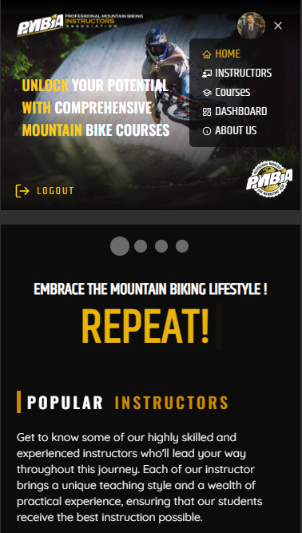
</p>

<br/>

- ***Registration & Login System:*** The website supports user registration and login with fields for name, email, password, photo URL, and optional fields like gender, phone number, and address. Captcha and Social login is also integrated.
  - ***Login:***
  <p align="center">
     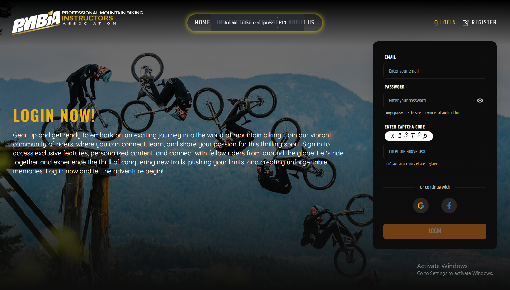
  </p>

  - ***Register as a student:***
  <p align="center">
     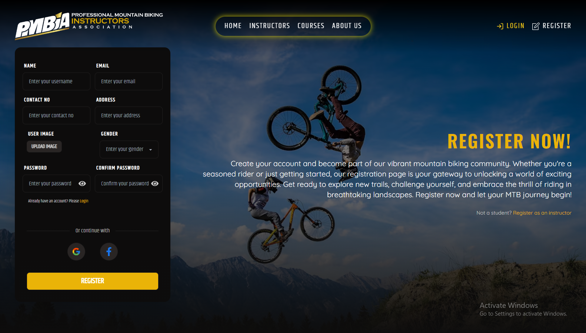
  </p>

  - ***Register as an insturctor:***
  <p align="center">
     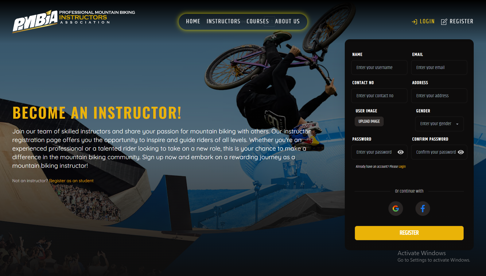
  </p>

<br/>

- ***Instructors Page:*** Users can search for instructors, view their name, email, and the number of courses they have taken. Users can also visit the instructors' individual walls for more detailed information.
  <p align="center">
     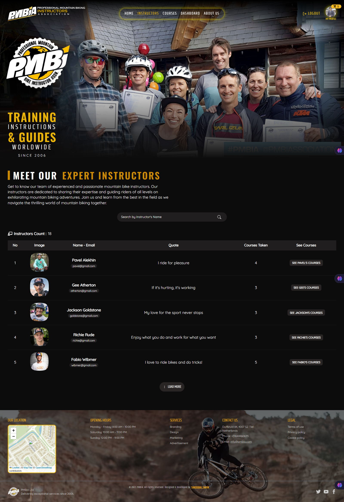
  </p>

  <br/>
  
- ***Courses Page:*** Users can search for courses, check seat status, view price details, see the instructor's name, and the course name. The page also allows users to book courses directly.
  <p align="center">
     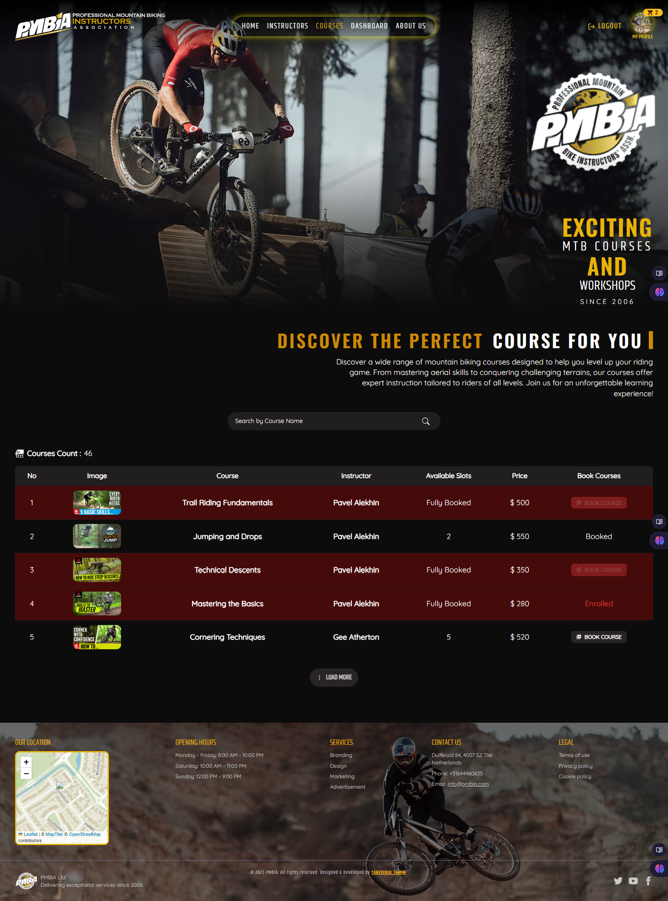
  </p>

  <br/>

- ***About Us Page:*** This page provides information about the website's purpose and other relevant details, helping users understand the mission and vision of the platform.
  <p align="center">
     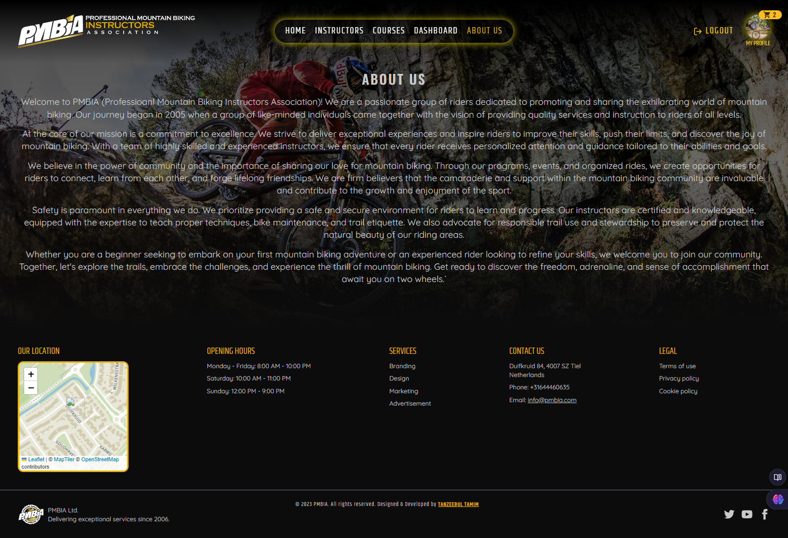
  </p>

  <br/>

- ***Interactive Dashboard:*** Separate dashboards for students and instructors with functionalities like selecting and enrolling in courses, managing courses, and courses payments.
  - ***Student Dashboard:***

    - ***User  Profile:***
    <p align="center">
       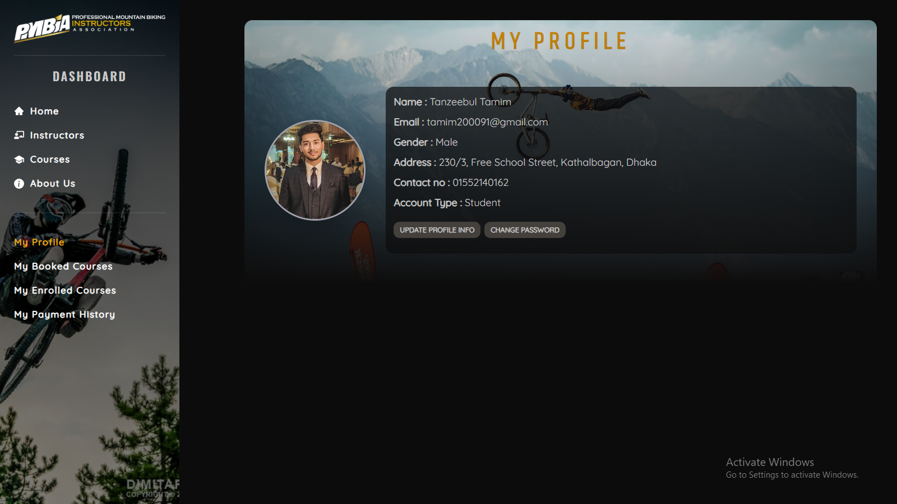
    </p>

    - ***Booked Courses:***
    <p align="center">
       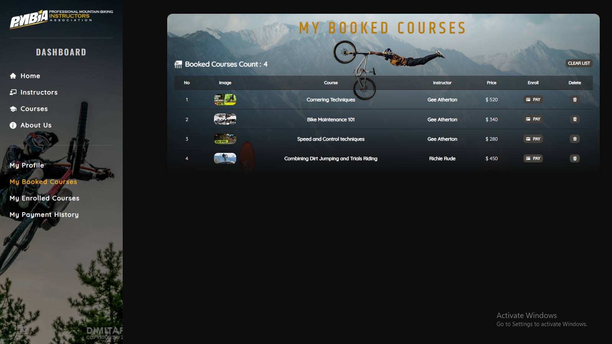
    </p>

    - ***Payment Methods:***
    <p align="center">
       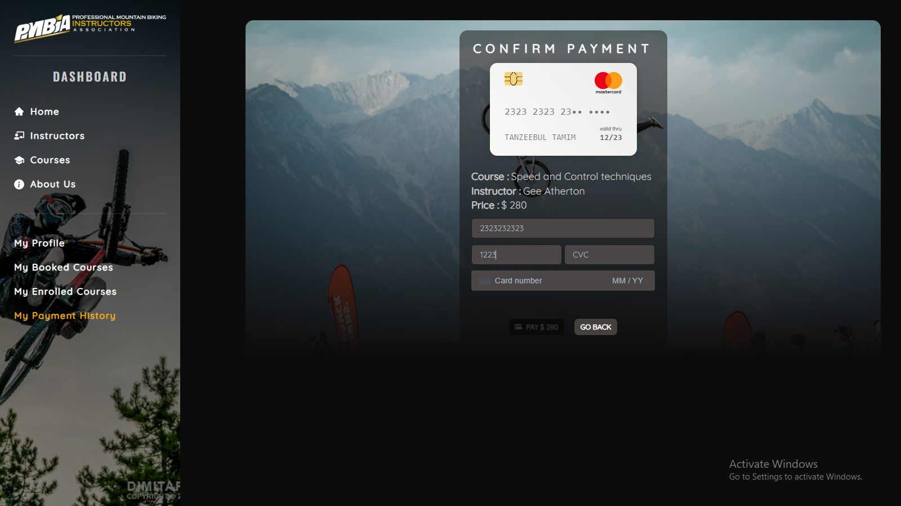
    </p>

    - ***Payment History:***
    <p align="center">
       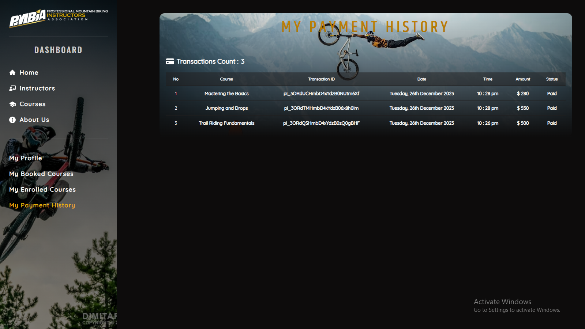
    </p>

    - ***Receive confirmation email after successfully purchasing a course:***
    <p align="center">
       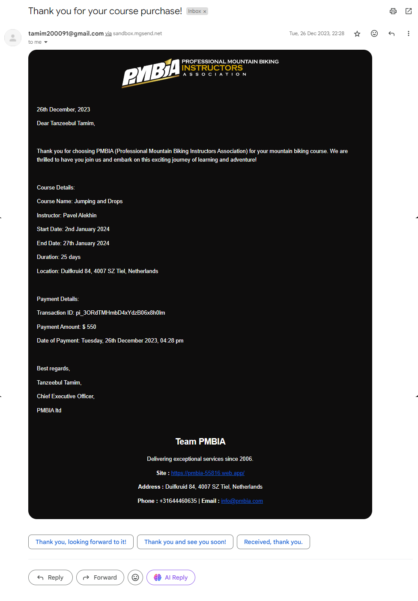
    </p>

<br/>

- ***Instructor Dashboard:***

    - ***User  Profile:***
    <p align="center">
       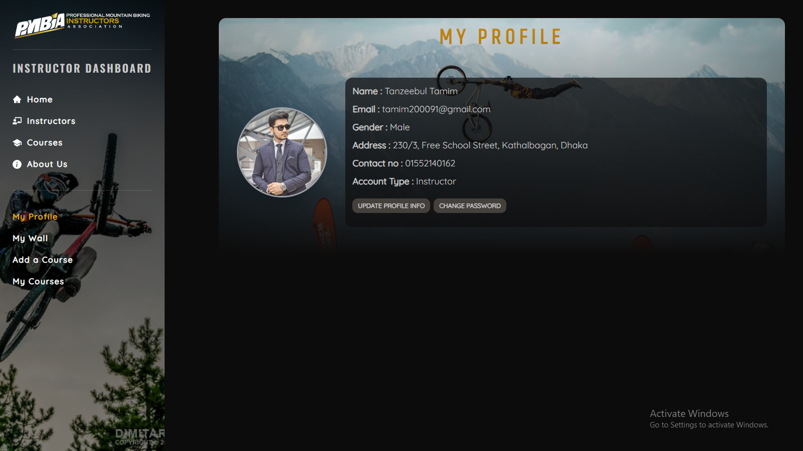
    </p>

    - ***My Courses:***
    <p align="center">
       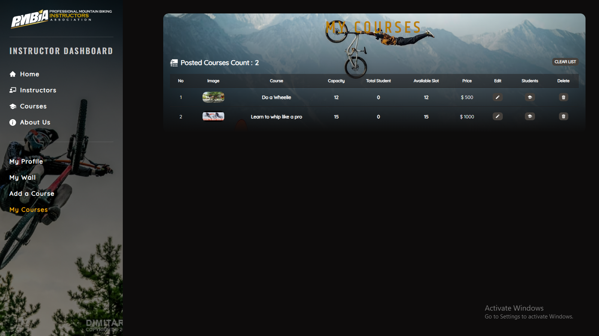
    </p>

    - ***Add a Course:***
    <p align="center">
       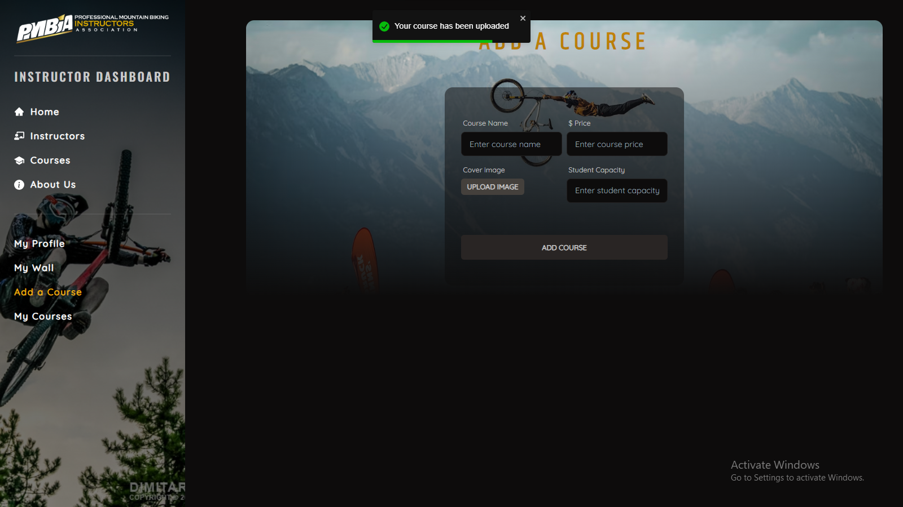
    </p>

<br/>

- ***Instructor's Wall:*** Separate dedicated page for each instructor to showcases all the courses offered by them.
<p align="center">
  
</p>

## Live Deployment

Check out the live site: https://pmbia-55816.web.app/

## Used Packages and Technologies

- **React**: Core library for building user interfaces
- **React Router**: For routing and navigation
- **Tailwind CSS**: Utility-first CSS framework
- **DaisyUI**: Tailwind CSS components
- **Axios**: For making HTTP requests
- **Firebase**: For authentication
- **Tanstack Query (React Query)**: For data fetching and state management
- **JWT**: For authentication
- **Environment Variables**: For configuration
- **Stripe**: For payment processing
- **SweetAlert2**: For beautiful alerts
- **React Hook Form**: For handling form validation
- **Emotion**: For styling components
- **Moment**: For date manipulation
- **Swiper**: For creating sliders
- **React Toastify**: For toast notifications
- **React Icons**: For icons
- **React Leaflet**: For interactive maps
- **React Simple Typewriter**: For typewriter effects
- **React Awesome Reveal**: For awesome animations

## Prerequisites

- Node.js
- npm

## Installation

1. Clone the repository:
   ```sh
   git clone https://github.com/Tanzeebul-Tamim/PMBIA-client-assignment-12
   ```
2. Install dependencies:
   ```sh
   cd summer-camp-client
   npm install
   ```
3. Create a `.env` file and add your environment variables:
   ```sh
   REACT_APP_API_URL=your-api-url
   MONGODB_URI=your-mongodb-uri
   ```

## Running the Project

```sh
npm run dev
```

## Also checkout PMBIA-Server
Visit the server-side repository of the PMBIA website - https://github.com/Tanzeebul-Tamim/PMBIA-Server

## Contributing

Feel free to contribute by submitting a pull request. Please ensure that your code follows the project's coding standards and includes relevant tests.
